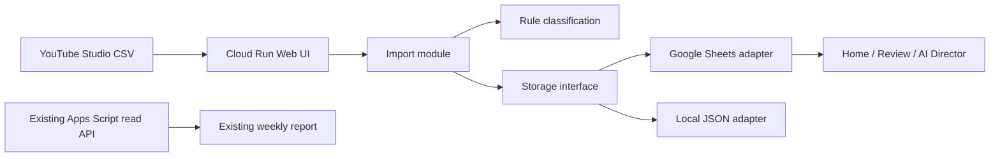

# 現在の構成とデータ設計

## 構成

保存モジュールのインターフェースは `read()` と `mutate()` の2つです。CSV取込は保存先の詳細を知らず、ローカルテストと本番で同じロジックを通ります。

## Google Sheets上の論理テーブル

| タブ | 概念 | 主キー |
|---|---|---|
| `AI_csv_imports` | csv_imports | id / fileHash |
| `AI_videos` | videos + reviewed video attributes | videoId |
| `AI_video_metrics` | analytics_periods + video_metrics | id、period + videoId + version |
| `AI_auto_classifications` | auto_classifications | id |
| `AI_classification_reviews` | classification_reviews | id |
| `AI_members` | members | id |
| `AI_video_categories` | video_categories / subcategories | id |

`tags`、`video_tags`、`video_members`、`thumbnails`、`thumbnail_tags`、`title_features` はフェーズ2以降に物理分離します。現段階では動画・自動判定JSON内に保持し、不要な複雑化を避けています。

## 重複・履歴

- ファイル: SHA-256が一致すれば処理しない。
- 指標: 期間 + 動画IDで既存を検出する。
- 更新CSV: 新しいversionを追加し、旧版の `current=false`、最新版を `current=true` にする。
- 動画属性: `status=confirmed` のユーザー確認済み値を自動処理で変更しない。
- 初回移行: 過去動画は `historical`。対象期間内に公開された動画だけ `unconfirmed`。

## 信頼度初期値

- 高: 8週以上かつ比較対象30動画以上
- 中: 4週以上かつ15動画以上
- 低: それ未満
- 判定不可: 必要データなし

閾値は将来 `system_settings` へ移行します。

## 永続性比較

| 保存先 | 費用 | 運用 | 現段階 |
|---|---|---|---|
| Google Sheets | 既存契約内 | 現場が直接確認可能 | 採用 |
| Firestore | 無料枠あり、課金設定が必要 | 拡張しやすい | 将来候補 |
| Cloud SQL | 常時費用が発生 | SQL分析に強い | データ増加後 |
| Cloud Runローカルファイル | 一時的 | 再起動で消失 | 本番禁止 |

## セキュリティ

- 読取サイトは現状公開。数値の公開範囲は別途方針決定が必要。
- 書込APIは `ADMIN_ACCESS_TOKEN` がないと503、誤りなら401。
- トークンはHTTPSで送り、ブラウザのsessionStorageにのみ保持する。
- APIキー・OAuth JSONはGit除外。
- 本番SheetsはCloud Run実行サービスアカウントへファイル単位で共有する。
- 将来はGoogle Workspaceログインへ置換することを推奨する。
