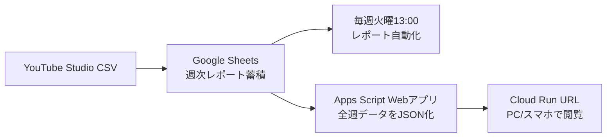

# Google Cloud公開設計

## 推奨構成

今回は Cloud Run に静的ダッシュボードを載せる構成にします。



## なぜ Cloud Run か

- URL共有が簡単。
- スマホでもそのまま見られる。
- 静的サイトでも小さなWebサーバーとして動かせる。
- 必要なら後から社内限定アクセスに切り替えやすい。
- サイト本体はCloud Run、週次データはGoogle Sheetsに分けられる。
- 毎週のデータ更新だけなら、Cloud Runの再デプロイは不要。

## 公開範囲

### パターンA: URLを知っている人が見られる

`ALLOW_UNAUTHENTICATED=true` にします。

メリット:
- スマホから開きやすい。
- 共有が簡単。

注意:
- ダッシュボード上の数値はURLを知っている人に見えます。
- スプレッドシート自体の権限とは別です。

### パターンB: 社内Googleアカウントだけ

`ALLOW_UNAUTHENTICATED=false` にして、Cloud Run Invoker 権限を社内メンバーに付けます。

メリット:
- 数値の社外流出リスクを下げられる。

注意:
- スマホでもGoogleログインが必要です。
- 権限付与の運用が必要です。

### パターンC: 独自ドメイン + IAP

より正式運用にする場合の構成です。Cloud Load Balancing、IAP、独自ドメインを組み合わせます。

メリット:
- `https://akb-dashboard.example.com` のようなURLにできる。
- アクセス制御を強化できる。

注意:
- 設定量と費用が増えます。

## 初回デプロイ

1. Google Cloudでプロジェクトを用意します。
2. ローカルにGoogle Cloud CLIを入れ、ログインします。
3. `deploy/cloud-run.env.example` を `deploy/cloud-run.env` にコピーします。
4. `PROJECT_ID` を実際のGoogle CloudプロジェクトIDに変えます。
5. 次を実行します。

```bash
cd /Users/terakadotomohiro/Documents/Youtubeリサーチ/akb-weekly-dashboard
bash deploy/deploy-cloud-run.sh
```

最後に表示されるURLが、社内やスマホから開けるWebサイトURLです。

## 毎週火曜15:00の更新

既存の週次レポート自動化でスプレッドシートが更新された後、サイトはApps Script Webアプリから最新の全週データを読みます。

1. `CSV_週次集計` に週次データが蓄積される。
2. `自チャンネル動画` と `企画案` に同じ週開始日の行が蓄積される。
3. `目標設定` の目標値をもとに、累計進捗と達成見込みを計算する。
4. サイト上部のプルダウンで、表示したい週を選ぶ。

サイトのデザインや計算ロジックを変えた時だけ、GitHubに反映してCloud Runへ再デプロイします。

## 参考にしたGoogle公式ドキュメント

- Cloud Runはコンテナイメージをサービスにデプロイできます。
- Cloud Runコンテナは、環境変数 `PORT` で指定されたポートをリッスンする必要があります。
- Cloud RunはIAMでアクセス制御でき、公開アクセスも設定できます。
